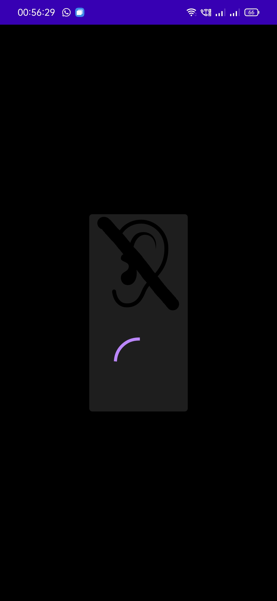
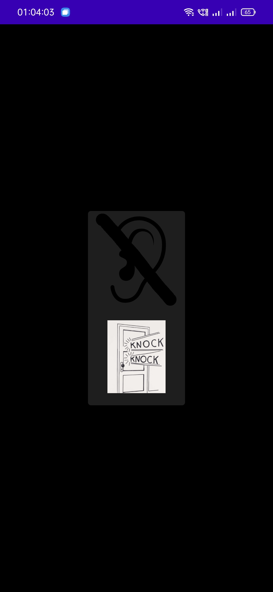

# Sound Recognition

## :scroll: Description
Sound Recognition Android App Using Jetpack Compose and HMS ML Kit
- [HMS ML Kit Sound Detection](https://developer.huawei.com/consumer/en/doc/development/HMSCore-Guides/sound-detection-0000001055282786)
- [JetPack Compose](https://developer.android.com/jetpack/compose)

With HMS ML Kit Sound Detection one will be able to detect up to 12 different sounds:
 
- LAUGHTER
- BABY_CRY
- SNORING
- SNEEZE
- SCREAMING
- MEOW
- BARK
- WATER
- CAR_ALARM
- DOORBELL
- KNOCK
- ALARM
- STEAM_WHISTLE

## :camera_flash: App screenshots
- **WATER**

&emsp;&emsp;

- **MEOW-MEOW CAT**

&emsp;&emsp;

- **KNOCK KNOCK DOOR**

&emsp;&emsp;

- **BABY CRYING**

&emsp;&emsp;
